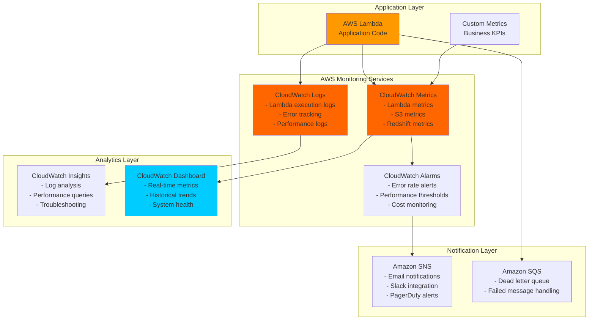
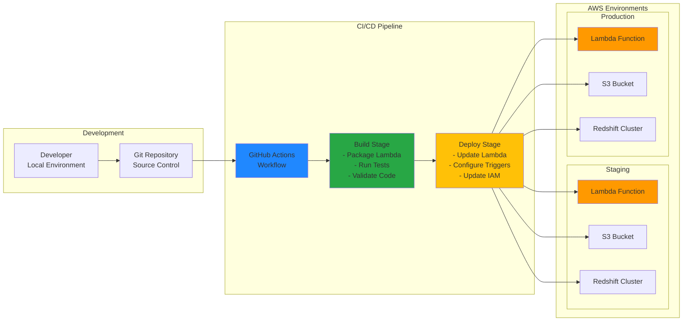

# Architecture Diagrams - S3 to Redshift Data Pipeline# S3-to-Redshift Pipeline Architecture Diagrams

## System Architecture Overview## System Architecture Overview

### High-Level Architecture Diagram```

┌─────────────────────────────────────────────────────────────────────────────────────┐

````mermaid│ AWS S3-to-Redshift Pipeline                            │

graph TB├─────────────────────────────────────────────────────────────────────────────────────┤

    subgraph "Data Sources"│                                                                                     │

        DS1[JSON Files]│  ┌─────────────┐    ┌──────────────┐    ┌─────────────┐    ┌──────────────┐      │

        DS2[CSV Files]│  │             │    │              │    │             │    │              │      │

        DS3[External APIs]│  │ Data Source │───▶│   S3 Bucket  │───▶│   Lambda    │───▶│   Redshift   │      │

    end│  │ (Parquet)   │    │ siddhartha-  │    │ Function    │    │  Serverless  │      │

    │  │             │    │ redshift-    │    │ s3-redshift │    │ Workgroup    │      │

    subgraph "Data Processing Layer"│  └─────────────┘    │ bucket       │    │ automation  │    │              │      │

        DG[Order Generator<br/>Python Script]│                     └──────────────┘    └─────────────┘    └──────────────┘      │

        JP[JSON to Parquet<br/>Converter]│                            │                    │                    │            │

    end│                            │                    ▼                    │            │

    │                            │          ┌──────────────┐              │            │

    subgraph "AWS Cloud Infrastructure"│                            │          │     SNS      │              │            │

        S3[Amazon S3<br/>Data Lake]│                            │          │ Notifications│              │            │

        Lambda[AWS Lambda<br/>Automation Function]│                            │          │              │              │            │

        Redshift[Amazon Redshift<br/>Data Warehouse]│                            │          └──────────────┘              │            │

        CW[CloudWatch<br/>Logging & Monitoring]│                            │                    │                    │            │

        SNS[Amazon SNS<br/>Notifications]│                            │                    ▼                    │            │

    end│                            │          ┌──────────────┐              │            │

    │                            │          │    Email     │              │            │

    subgraph "Analytics Layer"│                            │          │ Notifications│              │            │

        BI[Business Intelligence<br/>Tools]│                            │          │              │              │            │

        DS4[Data Science<br/>Notebooks]│                            │          └──────────────┘              │            │

        API[Analytics APIs]│                            │                                        │            │

    end│                            ▼                                        ▼            │

    │                  ┌──────────────┐                          ┌──────────────┐      │

    DS1 --> DG│                  │ CloudWatch   │                          │   Database   │      │

    DS2 --> JP│                  │    Logs      │                          │   Analytics  │      │

    DS3 --> JP│                  │              │                          │              │      │

    DG --> JP│                  └──────────────┘                          └──────────────┘      │

    JP --> S3│                                                                                   │

    S3 --> Lambda└─────────────────────────────────────────────────────────────────────────────────────┘

    Lambda --> Redshift```

    Lambda --> CW

    Lambda --> SNS## Data Flow Sequence

    Redshift --> BI

    Redshift --> DS4```

    Redshift --> APIUser/System                S3 Bucket              Lambda Function           Redshift          SNS/Email

         │                        │                         │                     │                 │

    style Lambda fill:#ff9900     │ 1. Upload Parquet      │                         │                     │                 │

    style S3 fill:#3f8624     ├───────────────────────▶│                         │                     │                 │

    style Redshift fill:#8c4fff     │                        │                         │                     │                 │

```     │                        │ 2. S3 Event Trigger    │                     │                 │

     │                        ├────────────────────────▶│                     │                 │

### Detailed Component Architecture     │                        │                         │                     │                 │

     │                        │                         │ 3. Send Upload      │                 │

```mermaid     │                        │                         │    Notification     │                 │

graph LR     │                        │                         ├─────────────────────┼────────────────▶│

    subgraph "Local Development"     │                        │                         │                     │                 │

        OG[order_generator.py<br/>- Generate sample data<br/>- Multiple formats<br/>- Validation]     │                        │                         │ 4. Create Staging   │                 │

        JP[json_to_parquet.py<br/>- Data conversion<br/>- Schema optimization<br/>- Error handling]     │                        │                         │    Table            │                 │

    end     │                        │                         ├────────────────────▶│                 │

         │                        │                         │                     │                 │

    subgraph "Amazon S3"     │                        │ 5. COPY from S3        │                     │                 │

        SB[S3 Bucket<br/>parquet-data/]     │                        │    to Staging          │                     │                 │

        EN[Event Notifications<br/>ObjectCreated:Put]     │                        ├────────────────────────▶│────────────────────▶│                 │

        subgraph "S3 Objects"     │                        │                         │                     │                 │

            P1[order_summary.parquet]     │                        │                         │ 6. UPSERT Operation │                 │

            P2[order_items.parquet]     │                        │                         │    (Delete + Insert)│                 │

            P3[order_flattened.parquet]     │                        │                         ├────────────────────▶│                 │

        end     │                        │                         │                     │                 │

    end     │                        │                         │ 7. Send Success     │                 │

         │                        │                         │    Notification     │                 │

    subgraph "AWS Lambda"     │                        │                         ├─────────────────────┼────────────────▶│

        LF[Lambda Function<br/>s3-redshift-automation]     │                        │                         │                     │                 │

        subgraph "Lambda Components"     │ 8. Receive Email       │                         │                     │                 │

            EH[Event Handler]     │    Confirmation        │                         │                     │                 │

            SM[Schema Manager]     │◄───────────────────────┼─────────────────────────┼─────────────────────┼─────────────────┤

            TM[Table Manager]     │                        │                         │                     │                 │

            DL[Data Loader]```

            EH --> SM

            SM --> TM## AWS Service Integration

            TM --> DL

        end```

    end┌─────────────────────────────────────────────────────────────────────────────────┐

    │                              AWS Services Integration                            │

    subgraph "Amazon Redshift"└─────────────────────────────────────────────────────────────────────────────────┘

        RC[Redshift Cluster]

        subgraph "Database Objects"    ┌─────────────┐         ┌─────────────┐         ┌─────────────┐

            T1[order_summary<br/>Table]    │     IAM     │         │     S3      │         │   Lambda    │

            T2[order_items<br/>Table]    │             │         │             │         │             │

            T3[order_flattened<br/>Table]    │ • Execution │────────▶│ • Bucket    │────────▶│ • Function  │

        end    │   Role      │         │ • Events    │         │ • Triggers  │

    end    │ • Policies  │         │ • Storage   │         │ • Processing│

        │             │         │             │         │             │

    OG --> JP    └─────────────┘         └─────────────┘         └─────────────┘

    JP --> SB           │                       │                       │

    SB --> EN           │                       │                       │

    EN --> LF           ▼                       ▼                       ▼

    LF --> RC    ┌─────────────┐         ┌─────────────┐         ┌─────────────┐

    DL --> T1    │  Redshift   │         │ CloudWatch  │         │     SNS     │

    DL --> T2    │             │         │             │         │             │

    DL --> T3    │ • Serverless│◄────────│ • Logs      │────────▶│ • Topic     │

        │ • Database  │         │ • Metrics   │         │ • Email     │

    style LF fill:#ff9900    │ • Tables    │         │ • Alarms    │         │ • SMS       │

    style SB fill:#3f8624    │             │         │             │         │             │

    style RC fill:#8c4fff    └─────────────┘         └─────────────┘         └─────────────┘

````

## Data Flow Architecture## Lambda Function Internal Flow

### ETL Pipeline Flow```

┌─────────────────────────────────────────────────────────────────────────────────┐

````mermaid│ Lambda Function Internal Flow                           │

sequenceDiagram└─────────────────────────────────────────────────────────────────────────────────┘

    participant LDS as Local Dev System

    participant S3 as Amazon S3              S3 Event

    participant Lambda as AWS Lambda                 │

    participant RS as Amazon Redshift                 ▼

    participant CW as CloudWatch    ┌─────────────────────────┐

        │   lambda_handler()      │

    Note over LDS: Data Generation Phase    │   • Parse S3 event      │

    LDS->>LDS: Generate sample orders<br/>(order_generator.py)    │   • Extract file info   │

    LDS->>LDS: Convert JSON to Parquet<br/>(json_to_parquet.py)    │   • Validate file type  │

        └─────────────┬───────────┘

    Note over LDS,S3: Data Upload Phase                  │

    LDS->>S3: Upload parquet files                  ▼

    S3->>S3: Store in bucket/prefix structure    ┌─────────────────────────┐     ┌─────────────────────────┐

        │  send_notification()    │     │  load_to_redshift()     │

    Note over S3,Lambda: Event Trigger Phase    │  • Upload alert         │     │  • Create staging table │

    S3->>Lambda: S3 Event Notification<br/>(ObjectCreated:Put)    │  • SNS publish          │     │  • Truncate staging     │

    Lambda->>Lambda: Parse S3 event details    └─────────────────────────┘     │  • COPY from S3         │

                                       │  • UPSERT operation     │

    Note over Lambda,RS: Processing Phase                                   │  • Transaction mgmt     │

    Lambda->>S3: Get parquet metadata                                   └─────────────┬───────────┘

    Lambda->>Lambda: Extract table schema                                                 │

    Lambda->>RS: CREATE TABLE IF NOT EXISTS                  ┌──────────────────────────────┼──────────────────────────────┐

    Lambda->>RS: COPY FROM S3 TO Redshift                  │ Success                      │ Error                        │

                      ▼                              ▼                              │

    Note over Lambda,CW: Monitoring Phase    ┌─────────────────────────┐     ┌─────────────────────────┐                │

    Lambda->>CW: Log processing status    │  send_notification()    │     │  send_notification()    │                │

    Lambda->>CW: Record performance metrics    │  • Success message      │     │  • Error details        │                │

        │  • Data loaded count    │     │  • Troubleshooting tips │                │

    Note over RS: Analytics Ready    │  • Table information    │     │  • CloudWatch logs ref │                │

    RS->>RS: Data available for queries    └─────────────────────────┘     └─────────────────────────┘                │

```                  │                              │                              │

                  └──────────────────────────────┼──────────────────────────────┘

### Error Handling Flow                                                 │

                                                 ▼

```mermaid                                    ┌─────────────────────────┐

graph TD                                    │      User Email         │

    Start[S3 Event Received] --> Parse[Parse Event Details]                                    │   • Upload notification │

    Parse --> Validate{Valid Parquet File?}                                    │   • Success confirmation│

                                        │   • Error alerts        │

    Validate -->|No| Skip[Skip Processing]                                    └─────────────────────────┘

    Validate -->|Yes| Extract[Extract Table Name]```


    Extract --> Metadata{Get Parquet Metadata}## Database Schema & Operations

    Metadata -->|Error| LogError1[Log Metadata Error]

    Metadata -->|Success| CreateTable[Create/Update Table]```

    ┌─────────────────────────────────────────────────────────────────────────────────┐

    CreateTable --> TableResult{Table Operation Success?}│                        Redshift Database Operations                             │

    TableResult -->|Error| LogError2[Log Table Error]└─────────────────────────────────────────────────────────────────────────────────┘

    TableResult -->|Success| CopyData[COPY Data to Redshift]

                              Redshift Serverless

    CopyData --> CopyResult{COPY Success?}                    ┌─────────────────────────────┐

    CopyResult -->|Error| LogError3[Log Copy Error]                    │     order-analytics-        │

    CopyResult -->|Success| LogSuccess[Log Success]                    │        workgroup1           │

                        │                             │

    LogError1 --> DLQ[Send to Dead Letter Queue]                    │  Database: dev              │

    LogError2 --> DLQ                    └─────────────┬───────────────┘

    LogError3 --> DLQ                                  │

    LogSuccess --> End[Process Complete]                    ┌─────────────┴───────────────┐

    DLQ --> Notify[Send SNS Notification]                    │                             │

    Skip --> End                    ▼                             ▼

    Notify --> End          ┌─────────────────┐          ┌─────────────────┐

              │ orders (main)   │          │ orders_staging  │

    style LogError1 fill:#ffcccc          │                 │          │                 │

    style LogError2 fill:#ffcccc          │ order_id        │          │ order_id        │

    style LogError3 fill:#ffcccc          │ customer_name   │          │ customer_name   │

    style DLQ fill:#ff6666          │ product_name    │          │ product_name    │

    style LogSuccess fill:#ccffcc          │ quantity        │          │ quantity        │

```          │ price           │          │ price           │

          │ order_date      │          │ order_date      │

## Infrastructure Architecture          │ status          │          │ status          │

          └─────────────────┘          └─────────────────┘

### AWS Services Integration                    │                             │

                    │            UPSERT           │

```mermaid                    │        ┌─────────────┐      │

graph TB                    │        │   Process   │      │

    subgraph "AWS Account"                    │        │             │      │

        subgraph "Compute Layer"                    │        │ 1. COPY     │◄─────┤

            Lambda[AWS Lambda<br/>s3-redshift-automation<br/>- Python 3.9<br/>- 1024MB Memory<br/>- 15min Timeout]                    │        │ 2. DELETE   │      │

        end                    │        │ 3. INSERT   │──────┤

                            │        └─────────────┘      │

        subgraph "Storage Layer"                    │                             │

            S3[Amazon S3<br/>- Event Notifications<br/>- Versioning Enabled<br/>- Server-side Encryption]                    ▼                             ▼

        end          ┌─────────────────┐          ┌─────────────────┐

                  │   Final Data    │          │  Temp Storage   │

        subgraph "Analytics Layer"          │  (Consistent)   │          │  (Transient)    │

            Redshift[Amazon Redshift<br/>- dc2.large nodes<br/>- Encrypted at rest<br/>- VPC deployment]          └─────────────────┘          └─────────────────┘

        end```


        subgraph "Monitoring Layer"## Error Handling & Recovery Flow

            CW[CloudWatch<br/>- Lambda Logs<br/>- Custom Metrics<br/>- Alarms]

            SNS[Amazon SNS<br/>- Error Notifications<br/>- Processing Alerts]```

        end┌─────────────────────────────────────────────────────────────────────────────────┐

        │                        Error Handling & Recovery Flow                           │

        subgraph "Security Layer"└─────────────────────────────────────────────────────────────────────────────────┘

            IAM[AWS IAM<br/>- Execution Roles<br/>- Service Roles<br/>- Policies]

            VPC[Amazon VPC<br/>- Private Subnets<br/>- Security Groups<br/>- VPC Endpoints]                    Lambda Execution

        end                           │

    end                           ▼

                      ┌─────────────────┐

    S3 --> Lambda                  │  Try Block      │

    Lambda --> Redshift                  │  • S3 parsing   │

    Lambda --> CW                  │  • DB operations│

    Lambda --> SNS                  │  • Notifications│

    IAM --> Lambda                  └────────┬────────┘

    IAM --> Redshift                           │

    VPC --> Lambda              ┌────────────┼────────────┐

    VPC --> Redshift              │ Success    │    Error   │

                  │            │            │

    style Lambda fill:#ff9900              ▼            ▼            ▼

    style S3 fill:#3f8624    ┌─────────────┐ ┌─────────────┐ ┌─────────────┐

    style Redshift fill:#8c4fff    │   Normal    │ │  Exception  │ │   Timeout   │

    style IAM fill:#ff4444    │   Flow      │ │   Handler   │ │   Handler   │

```    │             │ │             │ │             │

    │ • Process   │ │ • Log error │ │ • Retry     │

### Network Architecture    │ • Notify    │ │ • Send SNS  │ │ • Alert     │

    │ • Complete  │ │ • Rollback  │ │ • Cleanup   │

```mermaid    └─────────────┘ └─────────────┘ └─────────────┘

graph TB           │              │              │

    subgraph "AWS Region"           └──────────────┼──────────────┘

        subgraph "Availability Zone A"                          │

            subgraph "Public Subnet A"                          ▼

                NAT1[NAT Gateway]                ┌─────────────────┐

            end                │  CloudWatch     │

            subgraph "Private Subnet A"                │  • Error logs   │

                Lambda1[Lambda Function<br/>Instance]                │  • Metrics      │

                RS1[Redshift Node 1]                │  • Alarms       │

            end                └─────────────────┘

        end                          │

                                  ▼

        subgraph "Availability Zone B"                ┌─────────────────┐

            subgraph "Public Subnet B"                │  Notification   │

                NAT2[NAT Gateway]                │  • Admin alert  │

            end                │  • User message │

            subgraph "Private Subnet B"                │  • Retry info   │

                Lambda2[Lambda Function<br/>Instance]                └─────────────────┘

                RS2[Redshift Node 2]```

            end

        end## Security Architecture


        subgraph "S3 Global Service"```

            S3Bucket[S3 Bucket<br/>parquet-data]┌─────────────────────────────────────────────────────────────────────────────────┐

        end│                            Security Architecture                                │

        └─────────────────────────────────────────────────────────────────────────────────┘

        IGW[Internet Gateway]

        VPCEndpoint[VPC Endpoint<br/>for S3]                           IAM Roles & Policies

    end                    ┌─────────────────────────────┐

                        │        Root Account         │

    Internet[Internet] --> IGW                    └─────────────┬───────────────┘

    IGW --> NAT1                                  │

    IGW --> NAT2                    ┌─────────────┼───────────────┐

                        │             │               │

    Lambda1 --> VPCEndpoint                    ▼             ▼               ▼

    Lambda2 --> VPCEndpoint        ┌─────────────────┐ ┌─────────────┐ ┌─────────────────┐

    VPCEndpoint --> S3Bucket        │  Lambda Role    │ │ Redshift    │ │   SNS Topic     │

            │                 │ │    Role     │ │   Permissions   │

    Lambda1 --> RS1        │ • S3 Read       │ │             │ │                 │

    Lambda2 --> RS2        │ • Redshift Data │ │ • S3 Access │ │ • Publish Only  │

    Lambda1 -.-> RS2        │ • SNS Publish   │ │ • Bucket    │ │ • Restricted    │

    Lambda2 -.-> RS1        │ • CloudWatch    │ │   Policy    │ │   Access        │

            └─────────────────┘ └─────────────┘ └─────────────────┘

    NAT1 --> Lambda1                │                 │                   │

    NAT2 --> Lambda2                │                 │                   │

                    ▼                 ▼                   ▼

    style Lambda1 fill:#ff9900        ┌─────────────────┐ ┌─────────────┐ ┌─────────────────┐

    style Lambda2 fill:#ff9900        │   Resources     │ │  S3 Bucket  │ │    Email        │

    style S3Bucket fill:#3f8624        │   Protected     │ │  Protected  │ │  Subscribers    │

    style RS1 fill:#8c4fff        │                 │ │             │ │                 │

    style RS2 fill:#8c4fff        │ • Least         │ │ • Encrypted │ │ • Verified      │

```        │   Privilege     │ │ • Access    │ │ • Confirmed     │

        │ • Time-based    │ │   Logging   │ │ • Protected     │

## Security Architecture        │   Access        │ │ • Versioned │ │   Endpoints     │

        └─────────────────┘ └─────────────┘ └─────────────────┘

### IAM Roles and Permissions```


```mermaid## Performance & Monitoring

graph TD

    subgraph "IAM Roles"```

        LER[Lambda Execution Role<br/>lambda-s3-redshift-role]┌─────────────────────────────────────────────────────────────────────────────────┐

        RSR[Redshift Service Role<br/>redshift-s3-access-role]│                          Performance & Monitoring                               │

    end└─────────────────────────────────────────────────────────────────────────────────┘


    subgraph "Lambda Permissions"                           CloudWatch Ecosystem

        LP1[CloudWatch Logs<br/>- CreateLogGroup<br/>- CreateLogStream<br/>- PutLogEvents]                    ┌─────────────────────────────┐

        LP2[S3 Permissions<br/>- GetObject<br/>- GetObjectMetadata]                    │      Central Monitoring     │

        LP3[Redshift Data API<br/>- ExecuteStatement<br/>- DescribeStatement<br/>- GetStatementResult]                    └─────────────┬───────────────┘

    end                                  │

                  ┌───────────────────┼───────────────────┐

    subgraph "Redshift Permissions"              │                   │                   │

        RP1[S3 Access<br/>- GetObject<br/>- ListBucket]              ▼                   ▼                   ▼

        RP2[COPY Operations<br/>- Load data from S3<br/>- Create tables]    ┌─────────────────┐ ┌─────────────────┐ ┌─────────────────┐

    end    │     Metrics     │ │      Logs       │ │     Alarms      │

        │                 │ │                 │ │                 │

    subgraph "AWS Services"    │ • Execution     │ │ • Lambda        │ │ • Error Rate    │

        Lambda[AWS Lambda]    │   Duration      │ │   Execution     │ │ • Duration      │

        S3[Amazon S3]    │ • Memory Usage  │ │ • Error Traces  │ │ • Memory        │

        Redshift[Amazon Redshift]    │ • Invocations   │ │ • Debug Info    │ │ • Failures      │

        CW[CloudWatch]    │ • Errors        │ │ • SQL Queries   │ │                 │

    end    └─────────────────┘ └─────────────────┘ └─────────────────┘

                  │                   │                   │

    LER --> LP1              └───────────────────┼───────────────────┘

    LER --> LP2                                  │

    LER --> LP3                                  ▼

    RSR --> RP1                    ┌─────────────────────────────┐

    RSR --> RP2                    │      Dashboard View         │

                        │                             │

    Lambda --> LER                    │ • Real-time Status          │

    Redshift --> RSR                    │ • Historical Trends         │

                        │ • Performance Graphs        │

    LP1 --> CW                    │ • Error Analytics           │

    LP2 --> S3                    │ • Usage Patterns            │

    LP3 --> Redshift                    └─────────────────────────────┘

    RP1 --> S3```


    style LER fill:#ff4444---

    style RSR fill:#ff4444

    style Lambda fill:#ff9900## Component Specifications

    style S3 fill:#3f8624

    style Redshift fill:#8c4fff### S3 Bucket Configuration

````

````

### Data Encryption FlowBucket Name: siddhartha-redshift-bucket

Region: us-east-1

```mermaidVersioning: Enabled

graph LREncryption: AES-256

    subgraph "Data at Rest"Event Notifications: ObjectCreated:*

        S3E[S3 Bucket<br/>SSE-S3 Encryption]Filter: *.parquet

        RSE[Redshift Cluster<br/>AES-256 Encryption]Access: Private with IAM roles

        LE[Lambda Environment<br/>KMS Encryption]```

    end

    ### Lambda Function Specs

    subgraph "Data in Transit"

        HTTPS[HTTPS/TLS 1.2<br/>API Calls]```

        SSL[SSL/TLS<br/>Database Connections]Function Name: s3-redshift-automation

        VPC[VPC Endpoints<br/>Private Network]Runtime: Python 3.9

    endArchitecture: x86_64

    Memory: 128 MB

    subgraph "Key Management"Timeout: 15 minutes

        KMS[AWS KMS<br/>Customer Managed Keys]Environment Variables: SNS_TOPIC_ARN

        IAM[IAM Policies<br/>Key Access Control]Execution Role: lambda-execution-role

    end```


    KMS --> S3E### Redshift Serverless Config

    KMS --> RSE

    KMS --> LE```

    Workgroup: order-analytics-workgroup1

    S3E --> HTTPSNamespace: default

    LE --> HTTPSRegion: us-east-1

    RSE --> SSLDatabase: dev

    Compute Capacity: Auto-scaling

    HTTPS --> VPCSecurity: VPC, IAM roles

    SSL --> VPC```


    IAM --> KMS### SNS Topic Details


    style KMS fill:#ffcc00```

    style S3E fill:#3f8624Topic: redshift-load-notifications

    style RSE fill:#8c4fffProtocol: Email

    style LE fill:#ff9900Subscription: user-email@domain.com

```Region: us-east-1

Message Format: Text/HTML

## Performance Architecture```


### Scaling Strategy---


```mermaid**Document Version**: 1.0

graph TB**Created**: November 12, 2025

    subgraph "Lambda Scaling"**Last Updated**: November 12, 2025

        LS[Lambda Service<br/>Auto-scaling]**Status**: Production Documentation

        subgraph "Concurrent Executions"
            L1[Instance 1]
            L2[Instance 2]
            L3[Instance N]
            Dots[...]
        end
        RC[Reserved Concurrency<br/>Limit: 10]
    end

    subgraph "S3 Performance"
        S3P[S3 Performance<br/>Request Rate Scaling]
        subgraph "Partitioning Strategy"
            P1[year=2025/month=11/day=13/]
            P2[year=2025/month=11/day=14/]
            P3[year=2025/month=11/day=15/]
        end
    end

    subgraph "Redshift Performance"
        RSP[Redshift Cluster<br/>Auto WLM]
        subgraph "Query Optimization"
            DK[Distribution Keys<br/>Even Distribution]
            SK[Sort Keys<br/>Timestamp Sorting]
            CZ[Compression<br/>Automatic]
        end
    end

    LS --> L1
    LS --> L2
    LS --> L3
    RC --> LS

    S3P --> P1
    S3P --> P2
    S3P --> P3

    RSP --> DK
    RSP --> SK
    RSP --> CZ

    L1 --> S3P
    L2 --> S3P
    L3 --> S3P

    L1 --> RSP
    L2 --> RSP
    L3 --> RSP

    style LS fill:#ff9900
    style S3P fill:#3f8624
    style RSP fill:#8c4fff
````

### Data Partitioning Strategy

```mermaid
graph TD
    subgraph "S3 Bucket Structure"
        Root[s3://parquet-data-bucket/]

        subgraph "Partition by Date"
            Y2025[year=2025/]
            M11[month=11/]
            D13[day=13/]
        end

        subgraph "Partition by Data Type"
            Summary[order_summary/]
            Items[order_items/]
            Flattened[order_flattened/]
        end

        subgraph "File Level"
            F1[order_summary_20251113_001.parquet]
            F2[order_items_20251113_001.parquet]
            F3[order_flattened_20251113_001.parquet]
        end
    end

    subgraph "Redshift Table Design"
        subgraph "Distribution Strategy"
            DS[DISTSTYLE AUTO<br/>Automatic distribution<br/>based on data patterns]
        end

        subgraph "Sort Key Strategy"
            SK[SORTKEY AUTO<br/>Automatic sort keys<br/>based on query patterns]
        end

        subgraph "Compression"
            COMP[ENCODE AUTO<br/>Automatic compression<br/>for optimal storage]
        end
    end

    Root --> Y2025
    Y2025 --> M11
    M11 --> D13
    D13 --> Summary
    D13 --> Items
    D13 --> Flattened
    Summary --> F1
    Items --> F2
    Flattened --> F3

    F1 --> DS
    F2 --> DS
    F3 --> DS
    DS --> SK
    SK --> COMP

    style Root fill:#3f8624
    style DS fill:#8c4fff
    style SK fill:#8c4fff
    style COMP fill:#8c4fff
```

## Monitoring Architecture

### Observability Stack



## Deployment Architecture

### CI/CD Pipeline



---

## Diagram Legend

| Color     | Service Type        | Examples                        |
| --------- | ------------------- | ------------------------------- |
| 🟠 Orange | Compute Services    | Lambda, EC2                     |
| 🟢 Green  | Storage Services    | S3, EBS                         |
| 🟣 Purple | Analytics Services  | Redshift, Athena                |
| 🔴 Red    | Security Services   | IAM, KMS                        |
| 🔵 Blue   | Monitoring Services | CloudWatch, X-Ray               |
| 🟡 Yellow | Management Services | CloudFormation, Systems Manager |

---

_Generated: November 2025_
_Architecture Version: 1.0_
